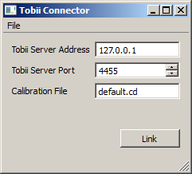

This repository is now archived. It never worked properly. Please find the other Tobii LSL apps.

== Usage ==

This program is currently untested since we don't have access to the hardware at this moment (http://www.tobii.com/) -- let me know if you find that it actually works. :-)

# Usage

  * Make sure that your eye tracker is running and can stream data. You need to have a calibration file (.cd file) created for your subject using an external application.

  * Start the Tobii app. This should give you a window like the following:
> > 

  * If the Tobii server is running on another machine than this app, you need to set the correct IP address of that machine. The port should match the default settings of the Tobii server and only needs to be changed when the server is reconfigured. Type in the file name for your calibration file.

  * To link the application to the LSL, click the "Link" button. If all goes well you should now have a new stream on the network with name "Tobii" and type "Gaze".

== Optional ==

The configuration settings can be saved to a .cfg file (see File / Save Configuration) and subsequently loaded from such a file (via File / Load Configuration). Importantly, the program can be started with a command-line argument of the form "Tobii.exe -c myconfig.cfg", which allows to load the config automatically at start-up. The recommended procedure to use the app in production experiments is to make a shortcut on the experimenter's desktop which points to a previously saved configuration customized to the study being recorded to minimize the chance of operator error.
